# 🎬 IMDb Top 1000 Movies (1920-2020) EDA

This project presents a comprehensive analysis of a dataset featuring the top 1000 movies on the IMDb platform, spanning a century of cinematography from 1920 to 2020. This project explores key features like movies' gross revenue, director popularity, genre distribution, runtimes, and actor influence to answer **35 stakeholder questions**. The analyis uncovers valuable trends and insights about the film industry.

**Original dataset:** [IMDb Movies dataset](dataset/imdb_top_1000.csv.xls)

**Google Colab:** [Project in Google Colab environment](https://colab.research.google.com/drive/1VLs5IQADC7SdWJhMAotvlgTyyXJgV_LQ?usp=sharing)

**Jupyter Notebook file:** [Project saved as .ipynb in this repo](jupyter_notebook/IMDb_Dataset.ipynb)

## 🎯 Project Goals

**EDA Aim:** the primary objective of this project is to perform an analysis to uncover overall trends in film industry among highly rated movies released between 1920 and 2020.

**Tasks:**
* **Initial Inspection:** to check the original dataset on any missing values or duplicates.
* **Data Manipulation:** to update data types and values for further analysis.
* **Descriptive Statistics:** to aggregate data on movies, gross revenues, actors and directors to answer stakeholders' questions.
* **Visualizing relationships** between variables in form of correlation scatter plots, heatmaps, and line charts.
* **Hypothesis testing:** to perform correlation tests to check if director's or actor's names have influence on gross revenue, also to define relationships between number of votes on the platform and movie rating, runtime and rating.
* **Conclusions and recommendations:** to summarize findings deriving meaningful insights about popular movies, directors, actors, and market trends over the 100-year period.

## 🐍 Python libraries

The analysis was executed in Jupyter Notebook (Google Colab) using:
* **Mounting on Drive:** `google.colab`
* **Data Processing:** `pandas`, `numpy`
* **Statistical analysis:** `scipy`, `skikit_posthoc`
* **Data Visualization:** `matplotlib`, `seaborn`, and `plotly.express`

## 📂 Project Structure

The project is divided into three main phases:

### **Part 1: Data Cleaning**

This initial phase focuses on ensuring the data quality and readiness for analysis. Key steps included:

  * **Data Mounting & Reading:** The dataset was read into the Colab environment after being mounted from Google Drive.
  * **Initial Inspection:** Examination of data types, initial statistical summaries, and identification of data anomalies.
  * **Anomaly & Duplicates Check:** Thorough inspection for any duplicate rows or inconsistent entries.
  * **Missing Value Handling:** Identification and strategic imputation or removal of missing data points to maintain dataset integrity.
  * **Data Transformation:** Necessary cleaning and updating of columns (e.g., converting revenue to numerical format, handling categorical data) for accurate EDA.

### **Part 2: Exploratory Data Analysis (EDA)**

This is the core analysis phase, which systematically addresses **35 questions** about the movies in the dataset. 

#### **Descriptive Statistics & Distributions**

To understand the central tendencies and spread of the data, we analyzed the core numerical features.

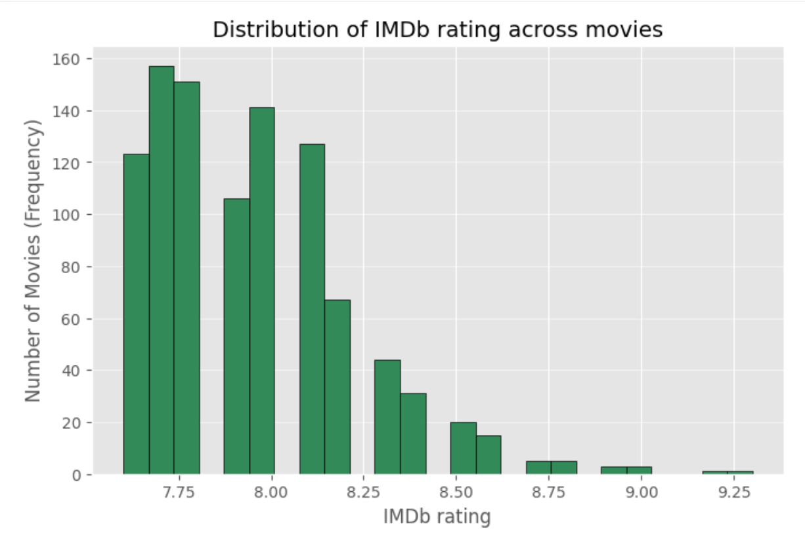
The histogram shows that the majority of top-rated movies fall within a tight range, heavily centered between 7.5 and 8.25 IMDb rating.
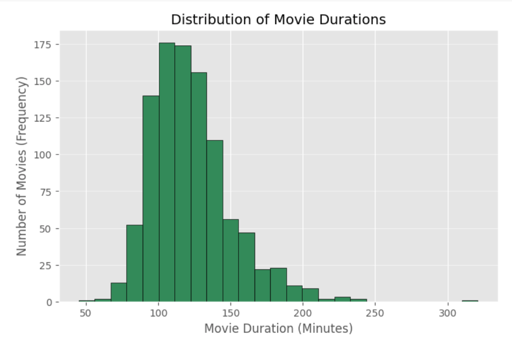
The runtime duration distribution is strongly right-skewed, peaking around the 100-125 minute mark, with fewer films exceeding 150 minutes.
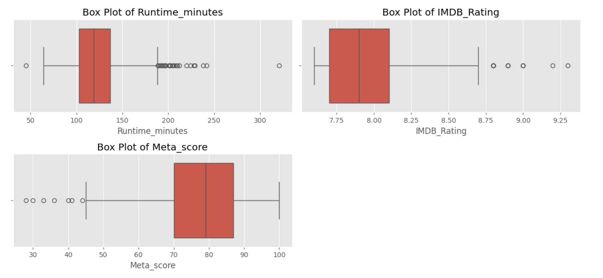
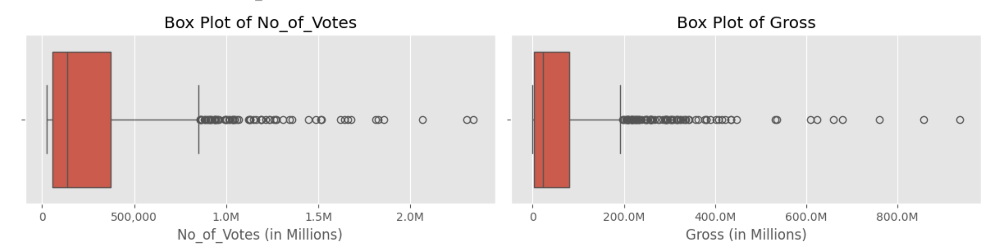
Box plots visually confirm significant outliers for runtime, number of votes, and gross revenue, indicating a few exceptional films heavily skew the financial and popularity metrics.

#### **Popularity & Count Analysis**

Treemaps were used to visualize the sheer dominance of specific categories and individuals:

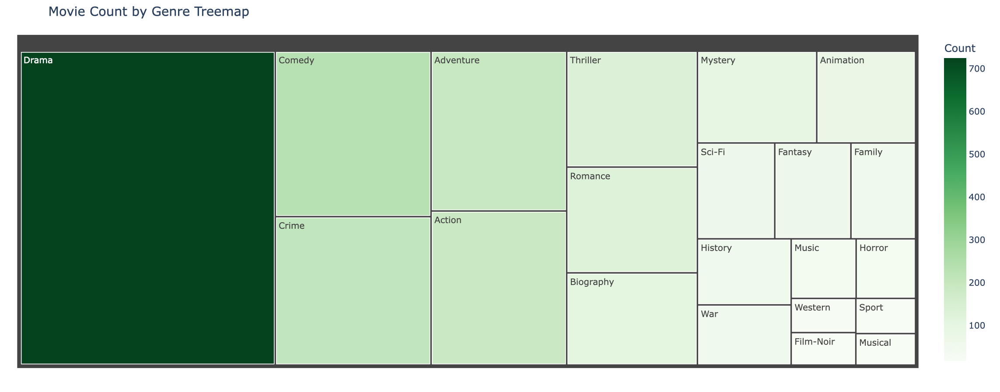
Genre Dominance: The genre distribution is dominated by Drama (724 movies), followed by Comedy (233 movies) and Crime (209 movies). The vast majority of movies are multi-genre.
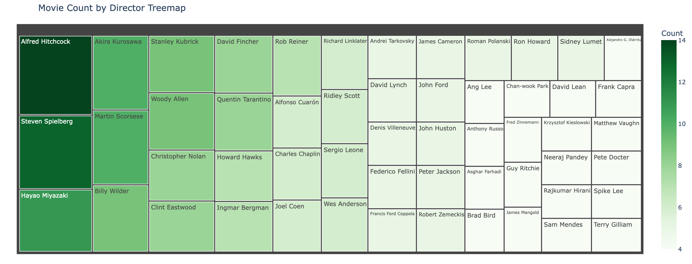
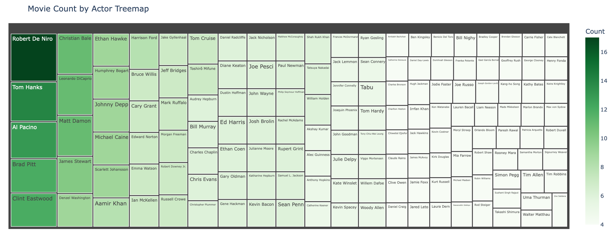
Key Individuals: Alfred Hitchcock is the most prolific director, while Robert De Niro leads the actor count.

#### **Time Series & Correlation Analysis**

The analysis explored trends over time and the relationships between key metrics:

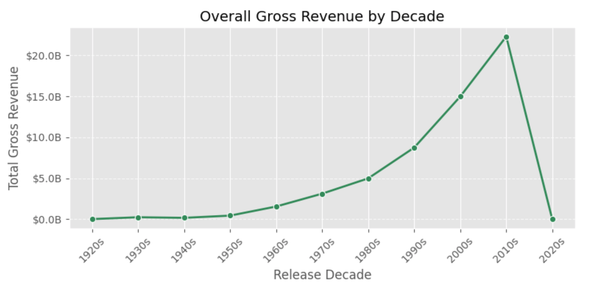

**Revenue Growth:** The line plot for Overall Gross Revenue by Decade shows an explosive, accelerating growth in total revenue, peaking sharply in the 2010s. The low value for the 2020s reflects the decade's incomplete data at the time of analysis (only year 2020 was included).

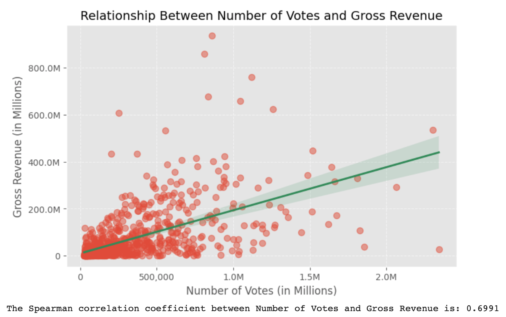

**Number of Votes vs. Gross Revenue:** A scatter plot confirms a moderately strong, positive monotonic relationship between Number of Votes and Gross Revenue (Spearman $\rho = 0.6991$), establishing vote count as a relatively good predictor of a film's financial success and vise versa.

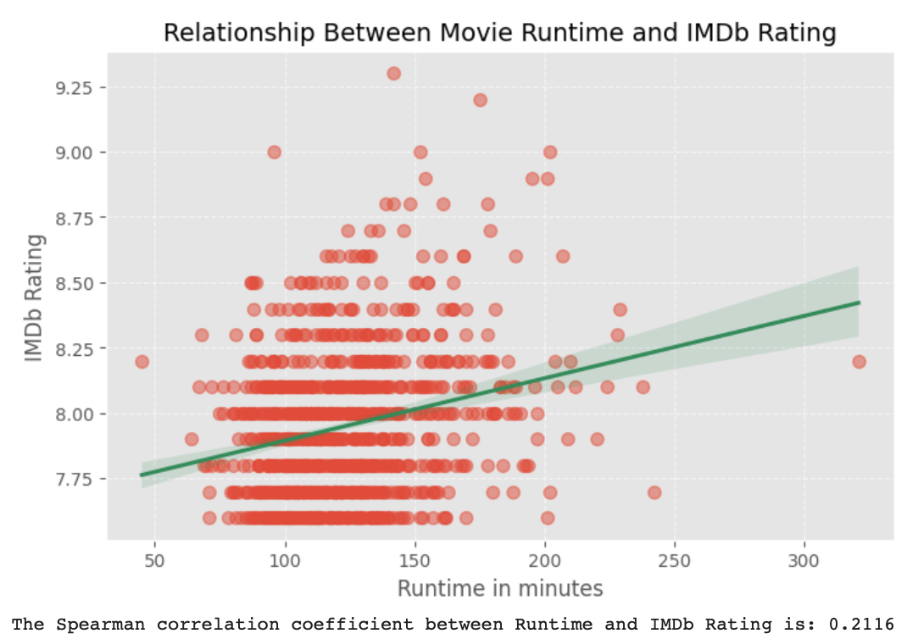

**Runtime vs. IMDb Rating:** A scatter plot confirms a weak positive correlation between the Movie Runtime and its IMDb Rating (Spearman $\rho = 0.2116$), indicating that longer movies marginally tend to be rated higher.

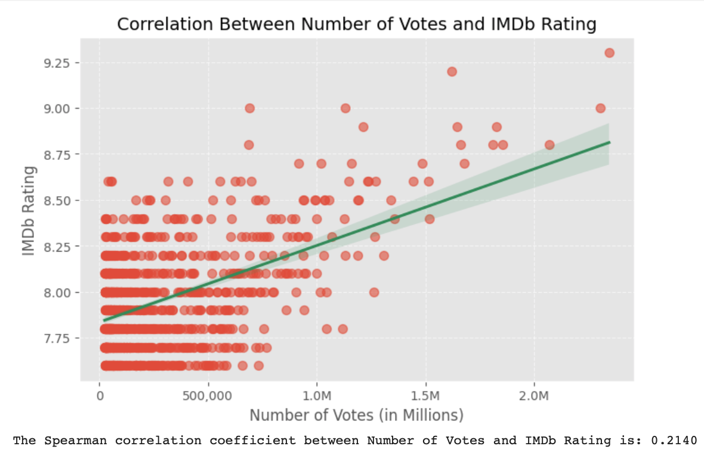

**Number of Votes vs. IMDb Rating:** A weak, positive monotonic relationship was found between the Number of Votes and IMDb Rating (Spearman $\rho = 0.2140$). This suggests movies with higher vote counts tend to have slightly higher ratings, but vote count is not a strong predictor.

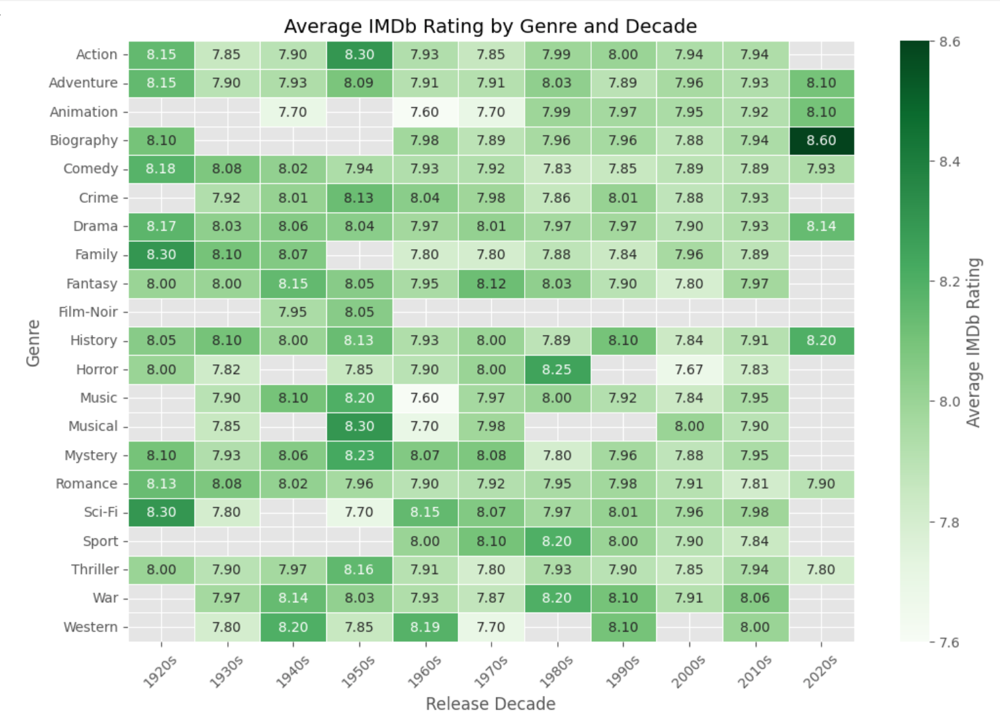

**IMDb Rating Over Time:** The heatmap shows the average rating of films by genre across decades.

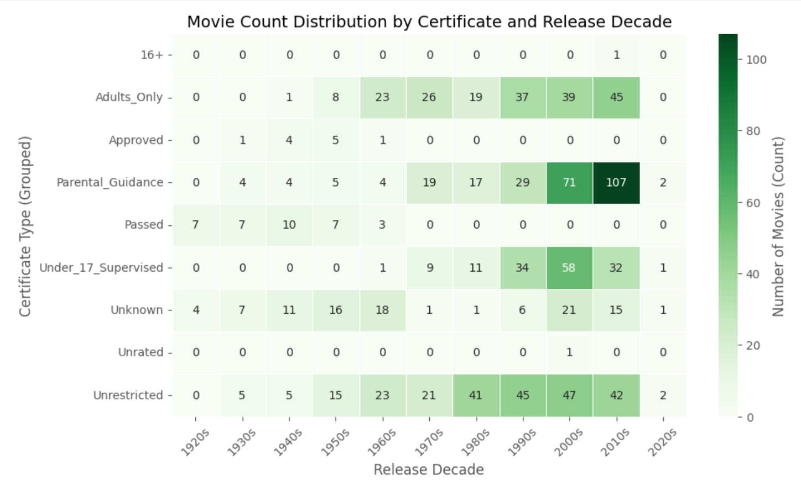

**Certification Trends:** The heatmap for Certificate Type by Release Decade shows a clear shift, with a massive increase in films categorized as 'Parental Guidance' in the 2000s and 2010s.

### **Part 3: EDA Summary**

This final part summarizes the main findings derived from the EDA.

#### **Overall Observations**

  * The dataset comprises **1000 movies** representing **21 genres** and featuring **548 directors**.
  * The average movie runtime is **122.9 minutes**.
  * The movie count per decade shows a clear trend of increasing releases over time, peaking after the year 2000.

#### **Ratings, Revenue, and Runtime Analysis**

  * The overall average IMDb rating for movies in the dataset is **$7.95$**.
  * The highest-rated movie is ***The Shawshank Redemption*** ($9.3$). **Frank Darabont** has the highest average rating among directors ($8.95$).
  * A small subset of **29 movies** achieved both a high IMDb rating ($\ge 8.5$) and a high Metascore ($\ge 85$).
  * The **Adventure** genre boasts the highest average grossing ($\$165,731,278.64$), and the movies with highest grossings are ***Star Wars: Episode VII - The Force Awakens*** and ***Avengers: Endgame***.

#### **Key Relationships and Statistical Findings**

  * The **Director's identity** has a highly statistically significant impact on a movie's median **Gross Revenue**, confirming that revenue is heavily stratified by Director. The 279 significant differences found in the Dunn's post-hoc test suggest the financial disparity is extensive, forming distinct performance clusters. However, the significant impact of **Director's identity** on **IMDb Rating** was not confirmed.
  * The **Actor's name** is a very powerful variable in determining median **Gross Revenue**. Unlike the **IMDb Rating**, in financial terms, hiring an actor from the top tier (blockbuster movies) is statistically associated with a vastly different median financial outcome than hiring a less popular actor. At the same time, many classic and international actors known for their iconic performance show significantly lower median gross revenue compared to modern stars.

#### **Limitations**

  * This analysis only included movies from the original dataset, the outliers were not excluded.
  * Some calculations depend on the fact that many movies in the dataset belong to several genres.
  * Movies with low gross revenue ($< \$100,000$) can distort calculations of gross revenues.

-----

## 🚀 How to Run the Project

1.  **Access:** [Google Colab Notebook file](ipynb/IMDb_Dataset.ipynb) saved in `.ipynb` format. Upload the file to your Google Colab or other environment which supports Jupyter Notebooks.
2.  **Dataset:** Upload the dataset from Kaggle to your Google Drive, as the script is configured to mount the drive. Alternatively, you can upload the dataset `.csv` file to the same folder, where you placed this Jupyter Notebook. Then delete the 4th code cell and change the code in the next one to read the  `.csv` file from directory.
3.  **Execution:** Run all cells sequentially within the Google Colab environment.
